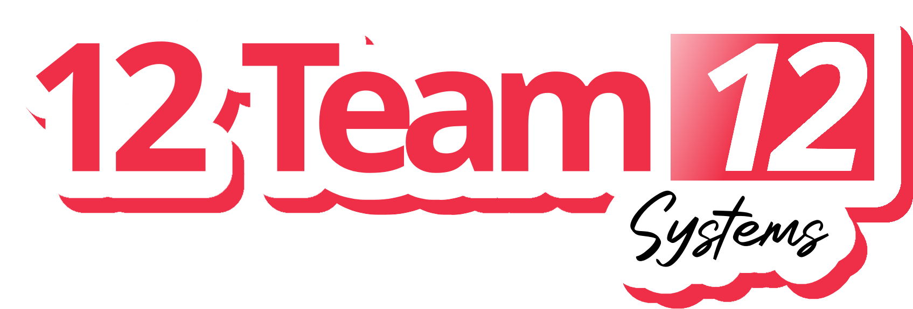

# Restaurant POS System

A full-stack restaurant point-of-sale and management platform built for a Panda Express-style fast-casual restaurant. Features role-based views for cashiers, kitchen staff, managers, and customers — with Google OAuth, multi-language support, and real-time weather integration.

Built as a team of 6 during CSCE 331 (Intro to Software Engineering) at Texas A&M University.



---

## Features

- **Cashier View** — Process orders, manage transactions, and handle payments
- **Kitchen View** — Real-time order queue for kitchen staff
- **Manager View** — Inventory management, sales reports, and employee administration
- **Customer Kiosk** — Self-service ordering with meal customization and a shopping cart
- **Menu Board** — Lockable customer-facing display
- **Google OAuth** — Secure sign-in for employees and managers
- **Multi-Language Support** — Google Translate integration for accessibility
- **Weather Widget** — Live weather display with city selection
- **Loyalty Program** — Customer points tracking

---

## Tech Stack

| Layer | Technology |
|---|---|
| **Frontend** | Vue.js 3, Vite, Tailwind CSS, Vuex, Vue Router |
| **Backend** | Ruby on Rails 7, Puma |
| **Database** | PostgreSQL (hosted on AWS) |
| **Auth** | Google OAuth 2.0, JWT |
| **Infrastructure** | Docker, Docker Compose, Nginx (reverse proxy) |
| **APIs** | Google Translate, OpenWeather |

---

## Getting Started

### Prerequisites

- [Docker Desktop](https://docs.docker.com/desktop/) (required)
- [Node.js 20 LTS](https://nodejs.org/) (optional, for local frontend dev)
- [Ruby + Rails](https://rubyinstaller.org/) (optional, for local backend dev)

### 1. Clone the repo

```bash
git clone https://github.com/camdenbalberg/restaurant-pos-system.git
cd restaurant-pos-system
```

### 2. Set up environment variables

Copy the example env file and fill in your values:

```bash
cp .env.example .env
```

See [`.env.example`](.env.example) for all required variables.

### 3. Run with Docker

Make sure Docker Desktop is running, then:

```bash
docker-compose up --build
```

### 4. Open the app

Navigate to **http://localhost** in your browser.

The API is available at `http://localhost/api/v1/`.

---

## Running Without Docker (Optional)

> Docker is recommended. Running services individually may cause port configuration issues.

**Backend:**
```bash
cd panda-web-app-backend
gem install bundler
bundle install
rails server
```

**Frontend:**
```bash
cd panda-web-app-frontend
npm install
npm run dev
```

---

## Meet the Team

<table>
  <tr>
    <td align="center"><br><b>Connor</b><br>Scrum Master</td>
    <td align="center"><br><b>Leonardo</b><br>Refactoring God</td>
    <td align="center"><br><b>Eduardo</b><br>Customer Concierge</td>
  </tr>
  <tr>
    <td align="center"><br><b>Nathan</b><br>Design Dynamo</td>
    <td align="center"><br><b>Steven</b><br>Clutch King</td>
    <td align="center"><br><b>Camden</b><br>Employee Enforcer</td>
  </tr>
</table>

<p align="center">
  
  <br><i>The whole crew</i>
</p>

---

## Project Structure

```
restaurant-pos-system/
├── panda-web-app-frontend/    # Vue 3 + Vite frontend
│   ├── src/
│   │   ├── views/             # Page-level components (Cashier, Kitchen, Manager, etc.)
│   │   ├── components/        # Reusable UI components
│   │   ├── api/               # Axios API client
│   │   ├── store/             # Vuex state management
│   │   └── assets/            # Images, logos, team photos
│   └── Dockerfile
├── panda-web-app-backend/     # Ruby on Rails API
│   ├── app/
│   │   ├── controllers/       # API endpoints
│   │   └── models/            # Database models
│   ├── config/                # Rails configuration
│   └── Dockerfile
├── nginx.conf                 # Nginx reverse proxy config
├── docker-compose.yml         # Multi-container orchestration
└── .env.example               # Environment variable template
```

---

## License

This project was built for educational purposes as part of CSCE 331 at Texas A&M University.
